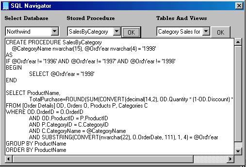



## SQL Navigator

### Description

SQL Navigator is a very good Demonstration of Viewing the Tables, Views & Procedures present in SQL just with the help of some SQL in-built functions through ADO. It will show you the data in the table & even the text of the Procedure which you had made in SQL. Might be unknown to someone how to use the SQL functions through VB just by passing them into the recordsets. It can be used very well by making an application. It is very small easy to understand, fast & hey.. dont forget to rate my code...!!!
 
### More Info
 
Any Valid Connection String for SQL Database

Matter of the Table or the View or the Procedure

             |
---                |---
**Submitted On**   |2003-09-08 05:09:04
**By**             |[Rachit K](https://github.com/Planet-Source-Code/PSCIndex/blob/master/ByAuthor/rachit-k.md)
**Level**          |Intermediate
**User Rating**    |5.0 (15 globes from 3 users)
**Compatibility**  |VB 6\.0, VB Script, VBA MS Excel
**Category**       |[Databases/ Data Access/ DAO/ ADO](https://github.com/Planet-Source-Code/PSCIndex/blob/master/ByCategory/databases-data-access-dao-ado__1-6.md)
**World**          |[Visual Basic](https://github.com/Planet-Source-Code/PSCIndex/blob/master/ByWorld/visual-basic.md)
**Archive File**   |[SQL\_Naviga164278982003\.zip](https://github.com/Planet-Source-Code/rachit-k-sql-navigator__1-48345/archive/master.zip)

